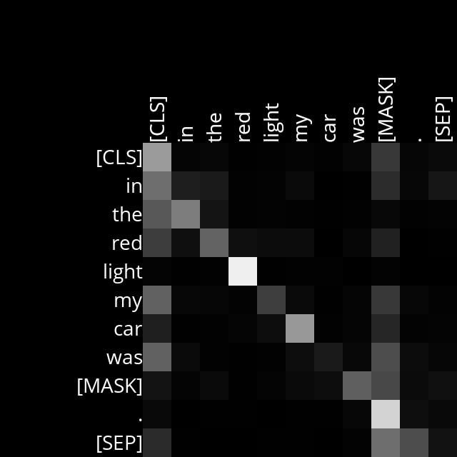
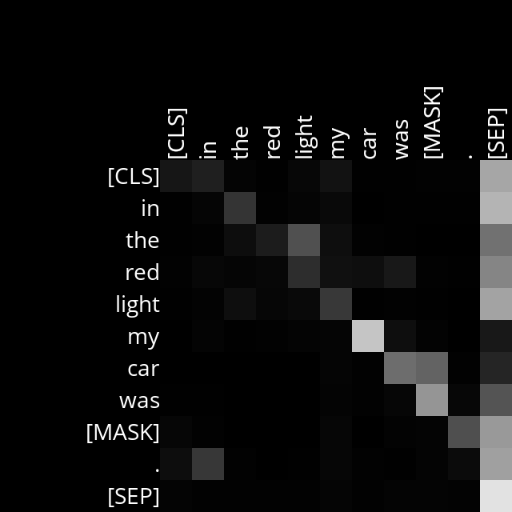

# Analysis

## Layer 1, Head 3 

Example Sentences:

- I love my [MASK] dog.

    The program is paying attention to the word "I" with "Love", which makes sense because one refers to the other, and the program is also paying attention to [MASK] with dog, which also makes sense because intuitively the word before dog refers to dog by context.  

    

- In the red light my car was [MASK].

    The program is paying attention to the word "red" with light", which makes sense because one refers to the other.  

    

In the resume this layer (1), head 3, the program is paying attention to all pronouns and adjectives.

## Layer 8, Head 3

Example Sentences:
- I love my [MASK] dog.

    The program in this case paid attention to each current word with the following word. However, it paid more attention to the word "I" with "Love."

    

- In the red light my car was [MASK].

    The program is paying attention again to the each current word with the following word. However, it paid more attention to the word "my" with "car".

    

In the resume this layer (8), head 3, the program is paying attention to each word with the next word.

